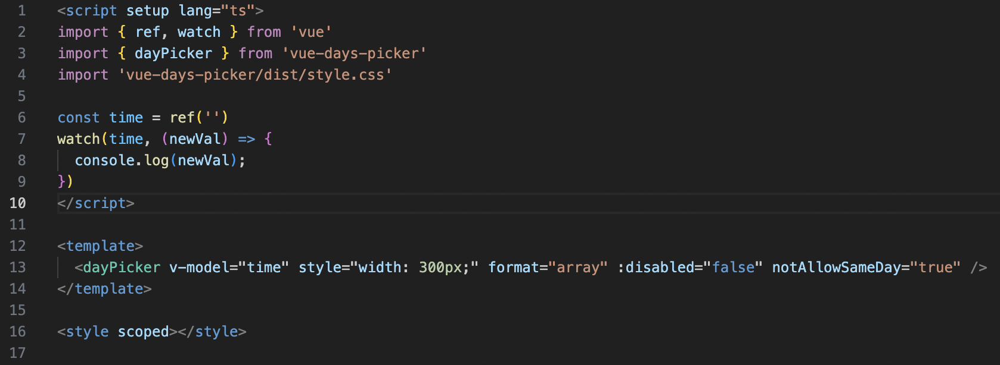

# 安装

npm i vue-days-picker --save-dev

# 使用

import { dayPicker } from 'vue-days-picker'
import 'vue-days-picker/dist/style.css'

# 参数

| 参数            | 类型                       |        备注        |
| :-------------- | :------------------------- | :----------------: |
| format          | string ("array"｜"object") |   返回的数据类型   |
| disabled        | boolean ("true"｜"false")  |      是否禁用      |
| notAllowSameDay | boolean ("true"｜"false")  | 是否可以选择同一天 |

# 示例

